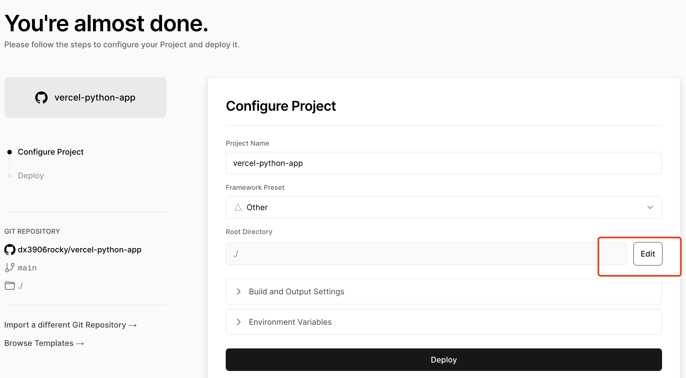
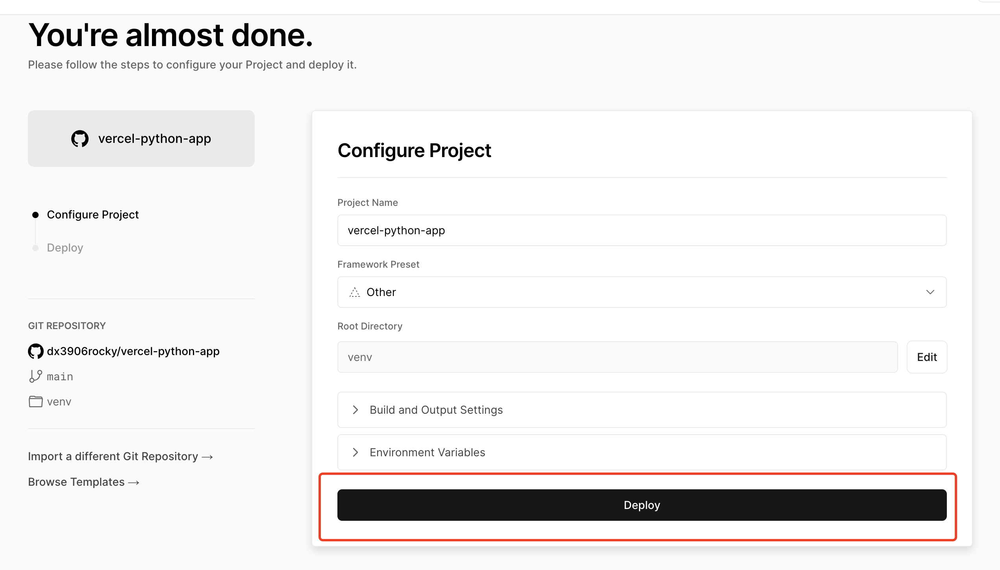

# vercel-python-app
vercel-python-app

## deploy python project to vercel.

## thanks to article:
    https://andrewbaisden.medium.com/how-to-deploy-a-python-flask-app-to-vercel-ff4a63d312f4

## We could also deploy project from github,the most important step is "selecting the root path".
   Just follow steps in the screenshots as below:

  
  
  
  
  

